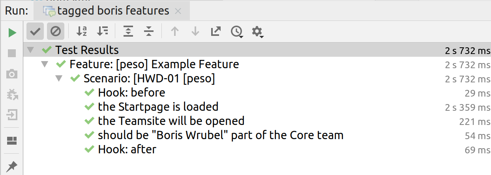

# kotlin-cucumber-selenium-skeleton

This is a skeleton which is based on selenium, cucumber with kotlin, and parallel-execution support with cucable.
Also cucumber-picocontainer are added for a smoothly usage of test data in all steps.

# How to run tests locally

You need to define some parameters to get the tests run as you expected

Example runtime parameters:

    -Dbrowser=chrome
    -Dbrowser.version=74.0
    -DbaseUrl="http://peso.inso.tuwien.ac.at"
    -Ddriver.version=74
    
browser see +sectrion browser-types
    
## screen

If you have a multiple monitor system and want to have the browser window on a dedicated screen just use the screen parameter: 
      
      -Dscreen=:0.0

Depending on your os the iDstring is different for your screens. GraphicsEnvironment Package is used. Use -DprintScreens=yes to get a list in log for next execution

# Run tests with a selenium grid, selenoid or appium

    -Dselenium.grid=http://<ip-of-your-grid:4444>

# Scenarios
## Feature file structure
For finding scenarios faster (especially if the fail) I used a template for scenarios with two components
* Filename is given in []
* Description of every scenario starts with [XXX-99 followed again with the [filename]

example:

    Feature: [peso] Example Feature

      Background:
        Given the Startpage is loaded

      Scenario: [HWD-01 [peso]
        Then the peso-logo should be displayed
      
      
[peso] means that peso is the filename, this makes it much easier to find steps if the IntelliJ-Runner or the jenkins-cucumber-reporter mark a scenario and/or a step if they are failing

scenarios have a unique ID. The ID is not checked anywhere, it is selforganzing, again if a scenario fails you can easily jump to the step definitions via text search in your IDE.

//TODO add here screenshots from jenkins

#Supported Browser
Webdriver Setup will be done with

webdriver manager (https://github.com/bonigarcia/webdrivermanager) from Boni Garcia  (https://github.com/bonigarcia/bonigarcia.github.io)

## chrome
chrome or chromium which is supported by chromedriver. 
## firefox

## mobile-chrome emulation (with user-agent
This will use the experimental feature 
 `chromeOptions.setExperimentalOption("mobileEmulation", mobileEmulation);`

chrome is used with a manipluated user-agnet. 

## mobile-chrome (via selenoid)
This only works if you have a selenoid or moon environment. Further information will follow.

example runtime configuration for an emulated Pixel 2 with a desktop chrome browser:

    -Dbrowser=chrome_mobile_emulation
    -Dbrowser.version=75.0
    -Ddriver.version=75
    -DbaseUrl="http://peso.inso.tuwien.ac.at"
    -DprintScreens=yes
    -Demulated.device="Pixel 2"
## Android device (via appium)
You can use a emulated device (avd-manager) or an connected real Device which is supported by appium.

    boris@xps13:~/Android/Sdk/platform-tools$ ./adb devices
    List of devices attached
    emulator-5554	device

Use Parameter to set the id `-Ddevice.id="emulator-5554"`

example runtime configuration for an emulated 8.1 Android device:

        -Dbrowser=android_device
        -DbaseUrl="http://peso.inso.tuwien.ac.at"
        -Dselenium.grid=http://localhost:4723
        -Ddriver.version=2.34
        -Ddevice.id="emulator-5554"

